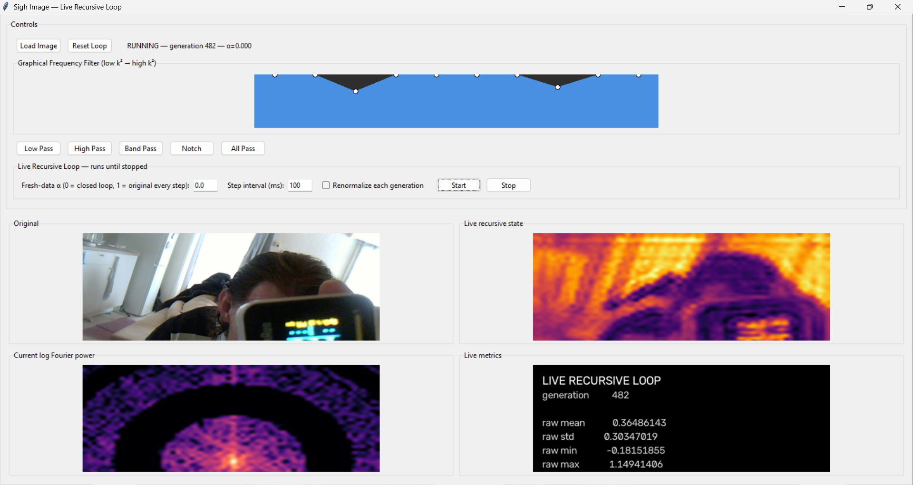

# SighImageSuper



## What survives when a system is fed its own tail?

This repo began as a recursive image filter. It became a small operator laboratory for a broader question:

> **Which differences between past events remain recoverable later, where are they carried, which question reveals them, and does asking the question change the memory?**

The original live loop is

```text
x_(n+1) = alpha * x_original + (1-alpha) * F(x_n)
```

At `alpha = 0`, the loop sees only descendants of its own previous output.

The visual starting point was simple: under the high-pass preset a photograph becomes a moving/fading spectral cloud and finally a checkerboard. That endpoint turned out to be mathematically simple. The transient, the routes through state space, the questions asked of the state, and the material changes around it became the real subject.

---

# 0. The checkerboard is an invariant mode

For the current 64x64 high-pass operator, the maximal gain reaches exactly `1.0` only at the joint Nyquist bin. On an even grid that real spatial mode is

```text
(-1)^(i+j)
```

so the final checkerboard is not merely the least-dying mode: it is an invariant direction of this exact operator.

For a fixed linear operator,

```text
x_n = A^n x_0 = sum_i c_i lambda_i^n phi_i
```

and a mode with `0 < |lambda| < 1` has recursive half-life

```text
n_half = log(1/2) / log(|lambda|).
```

This supplied the first useful sentence:

> **A structure does not only transform signals. It assigns them forgetting times.**

`gate0_spectral_receipt.py` predicts the surviving bin before iteration and verifies the long-run projection analytically.

---

# 1. The cloud is a Nyquist-carrier envelope

Multiply the state by

```text
M(i,j) = (-1)^(i+j)
```

and define `e_t = M x_t`. Because `M^-1 = M`,

```text
e_(t+1) = M A M e_t.
```

This shifts the Nyquist carrier to DC without changing the eigenvalues. The strange pre-checkerboard cloud can therefore be viewed as a **slow envelope riding on a fast checkerboard carrier**.

`gate1_nyquist_envelope.py` verifies this coordinate shift. `gate2_transient_dimension.py` then shows that the interesting part of the movie is not the one-dimensional endpoint but the interval during which many directions are still distinguishable.

A correction is important: the measured singular spectrum is a statement about `A^t`, not a literally "collapsing observability Gramian." For a delayed-observation question the useful object is

```text
W_(d,T) = (A^d)^T W_T A^d.
```

The waiting period destroys distinctions; the later observation window accumulates whatever remains.

---

# 2. Memory is not the same thing as a slow eigenmode

The gates now isolate at least three distinct physical carriers of history:

| carrier | what remains? | minimal example |
|---|---|---|
| **lingering trace** | activity itself | modes with different decay times |
| **travelling trace** | activity moves through successive states | directed delay line |
| **changed material** | experience alters later response geometry | teach -> silence -> question |

`gate4_travelling_trace.py` gives the clean counterexample to an eigenvalue-only story: an eight-cell directed chain retains an eight-item temporal history even though every eigenvalue of the autonomous update is zero. The history is recoverable while it travels; after eight silent steps it is exactly gone.

So the stronger definition is:

> **Memory is a distinction between possible histories that a later observer can still recover.**

For a linear input/state/readout system,

```text
K_k = C A^k B
```

where `B` says how the event enters, `A` evolves the substrate, and `C` says what the bounded observer can see.

---

# 3. Teach -> silence -> question

`gate3_teach_silence_question.py` creates two initially identical materials. One experiences `A -> B`; the other `B -> A`. Fast state is then erased exactly and both receive the same later probe.

The earlier order remains recoverable because teaching changed the material. The key point is not a changed decay spectrum. The two learned operators can have the same eigenvalues while routing the later probe differently.

`gate5_activity_written_query_geometry.py` strengthens this by making the propagated field itself participate in writing the local material.

After teaching and silencing, a central probe observed at the central port is exactly blind to the AB/BA distinction. A differential branch query reveals it at that same sensor.

This is the sharper Geometric Neuron result:

> **A memory can physically exist yet be invisible to one probe/readout geometry. Active questioning can reveal a distinction passive observation cannot see.**

---

# 4. Asking can rewrite the thing being asked

Once plasticity remains active, retrieval becomes an intervention.

`gate6_self_probe_negative_image.py` compares always-on plasticity, global freeze, and an ideal negative-image controller that subtracts the predicted consequence of its own probe before allowing material change.

The ideal result is deliberately narrow:

> **Suppressing the predicted consequences of your own query can protect structural memory without suppressing genuinely new external evidence.**

Later gates remove the most privileged assumptions.

- `gate7...` replaces exact self-prediction with a counted learned local echo model.
- `gate8...` attacks command-correlation: correlation with my action is not the same as caused by my action.
- `gate9...` adds a private dither/intervention that can identify the self-response when external activity follows the coarse command but not the private perturbation.

The resulting principle is:

> **A bounded system can separate causes only when its available interventions make those causes respond differently.**

See [`LATEST_RESULT.md`](LATEST_RESULT.md) for the newest receipts.

---

# 5. The numerical "last gasp"

The historical CUDA live loop used float16 storage. Near the smallest float16 subnormal, quantization becomes a strong nonlinearity: smooth low-amplitude fields can become sparse one-step patches whose abrupt edges create broad apparent Fourier support.

A control using `A = 0.5 I` demonstrates that the apparent late spectral re-expansion can be produced by float16 quantization even though the ideal operator only scales amplitude and cannot change spectral shape.

For scientific reruns, use the float32 launcher and inspect **absolute** Fourier power as well as auto-normalized displays.

---

# 6. New bridge: the old Perception Lab ECG loop

A September 2026 review finally clarified an older accidental observation that helped start the Geometric Neuron thread.

The archived graph and node implementations are now explained in:

- [GeometricNeuronOriginReview — ECG JSON / ECG-like pulse finally explained](https://github.com/anttiluode/GeometricNeuronOriginReview)
- source environment: [PerceptionLab — Lego set science](https://github.com/anttiluode/PerceptionLab)

The crucial correction is that the old graph was **not feeding four eigenmodes back into its controller**.

Its `Image -> Vector` node resized the checkerboard to a resolution-dependent square image, flattened it, and the splitter returned the first four scalar values. Changing vector size therefore changed the **spatial measurement operator** inside the feedback loop.

The graph was roughly:

```text
Homeostatic Coupler
        -> checkerboard scale
Checkerboard
        -> Image-to-Vector
        -> first four values
        -> Homeostatic Coupler
```

The Homeostatic Coupler estimated recent variance over a finite history window and switched between amplification and damping. Therefore changing what the loop measured changed the future checkerboard, which changed the next measurement, and so on.

The old ECG-like pulse is best understood as a nonlinear closed-loop effect:

```text
spatial state
   -> bounded measurement
   -> finite-memory controller
   -> changed generator
   -> changed spatial state
   -> ...
```

That is a much better bridge to Sigh than the old "four eigenmodes" story.

---

# 7. Inputs, observations, and dynamics are all ways of asking a question

The current research thread can now be written with three different intervention surfaces.

Start with

```text
x_(t+1) = A(theta) x_t + B u_t
y_t     = C x_t.
```

Then:

- changing `u` / `B` changes **where or how the question enters**;
- changing `C` changes **what the observer samples**;
- changing `A` changes **which directions persist, travel, amplify, or mix**.

If observation is itself fed back,

```text
u_t = p_t + K C x_t,
```

then the effective closed-loop operator becomes

```text
A_closed = A + B K C.
```

So a measurement inside feedback can do more than reveal a trajectory: it can help create the trajectory subsequently observed.

This is exactly why the old ECG loop now belongs in the same family as Sigh.

But there is also an important limitation in the current Sigh EQ: the FFT filters share the Fourier basis. Changing the EQ changes modal gains/lifetimes but does not rotate hidden directions into new ones. A stronger future gate should compare operators whose eigen/singular directions genuinely differ.

> **A question need not merely inject a signal. A question can temporarily change the dynamics through which the hidden state becomes visible.**

---

# 8. Direct bridge to Active Dendritic Identification

The dendrite fork is now:

- [OperaattoriAktiivinenDendriitti](https://github.com/anttiluode/OperaattoriAktiivinenDendriitti)

It asks a practical external-observer version of the same problem:

> **Given a known cell and a stored baseline, which physically realizable stimulation makes a plausible local change distinguishable from nuisance and model error at the available recording sites?**

Sigh contributes the conceptual result that a distinction may exist but require the right question. Active Dendrite turns that into experiment design. Operaattori supplies the morphology-to-response operator and its audited tangents.

The next extension suggested by the ECG bridge is stronger than stimulation selection alone: choose not only where to stimulate, but eventually an operating condition that changes the effective dynamics so that target sensitivities move away from nuisance sensitivities.

Examples could include timing, drive strength, active/nonlinear state, shunting context, holding state, or a controlled feedback condition — always with equal budgets and explicit back-action costs.

---

# 9. The larger research question

The recurring line across the repo collection has been:

> **Structure compiles an operator.**

Sigh added:

> **The operator compiles a hierarchy of persistence.**

The later gates forced a broader version:

> **Recoverable history can live in lingering state, travelling state, changed material, and the geometry of the questions available to the observer.**

The ECG bridge adds one more piece:

> **When observation participates in feedback, changing the question can change the future dynamics being observed.**

So the current operational question is:

> **Which distinctions can a bounded system make observable by choosing its inputs, observations, and temporary dynamics — while paying for uncertainty, reference memory, and the back-action of asking?**

This links the current projects without claiming that an FFT filter, the Perception Lab ECG toy, or the present three-port material is a biological neuron.

---

# Repo map

- [SighImageSuper](https://github.com/anttiluode/SighImageSuper) — persistence, travelling traces, changed material, self-probe control, causal interventions
- [GeometricNeuronOriginReview](https://github.com/anttiluode/GeometricNeuronOriginReview) — audited explanation of the original ECG feedback graph
- [PerceptionLab](https://github.com/anttiluode/PerceptionLab) — original node-based laboratory
- [OperaattoriAktiivinenDendriitti](https://github.com/anttiluode/OperaattoriAktiivinenDendriitti) — active experiment design for hidden dendritic changes
- [Operaattori](https://github.com/anttiluode/Operaattori) — morphology compiler and audited response/geometry tangents

---

## Claim boundary

Power iteration, Fourier filtering, modulation/demodulation, Krylov methods, controllability/observability, system identification, active experiment design, corollary discharge, adaptive control, structural memory, model collapse and continual learning are established subjects.

This repository does **not** claim to have invented those fields or discovered how neurons implement memory.

Its useful program is narrower:

> **Follow a distinction from event -> transient state -> transport -> changed material -> active question -> bounded readout, and measure when that distinction remains recoverable, when the question itself changes the system, and which interventions create information that passive observation cannot.**
